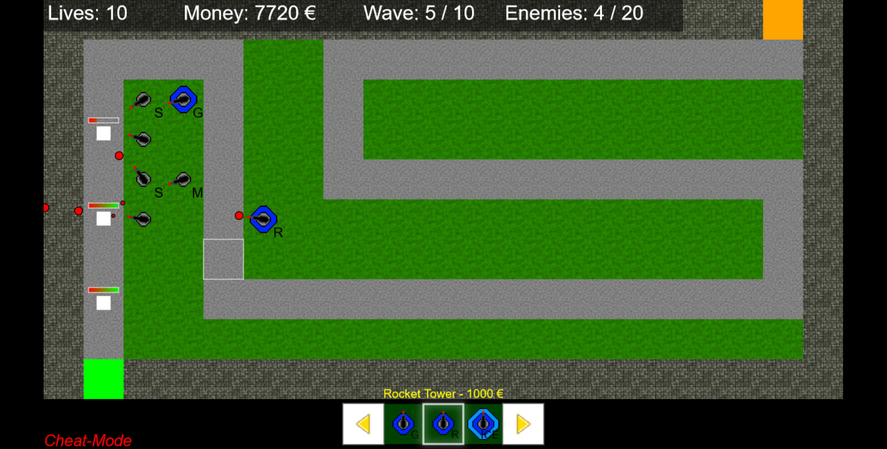

# Towadefu

This is a full tower defense game i wrote, which uses advanced HTML5 and Javascript techniques, like async script loading, modules resolving, etc.

It works on all modern browser and runs on mobile/tablet devices too ;-)

The main game does not require any dependencies, everything is written myself.

For the editor.html and calc.html, "Bootstrap UI" and "jQuery" is required (Sources are included)

## Run Requirements
Deploy the entire content of this folder to a HTML Webserver and run it in your browser or mobile device.

## Screenshot

